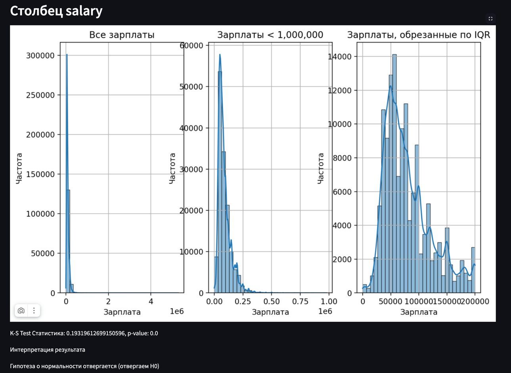
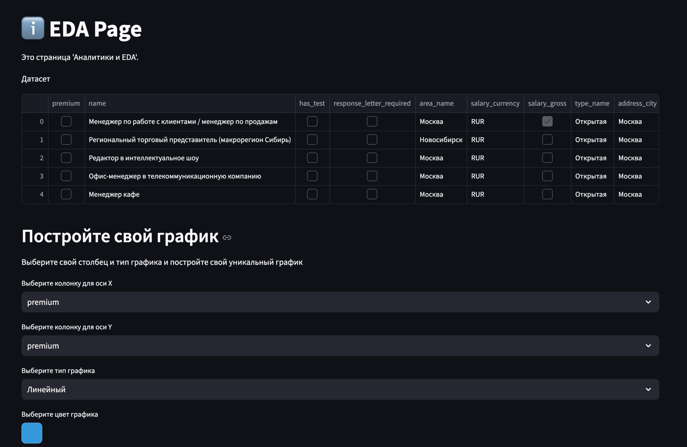
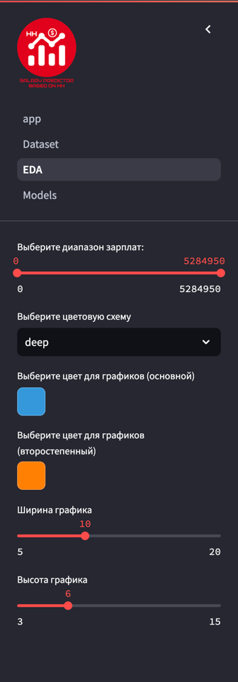

# Проект "Вакансии с портала HeadHunter"


### Студенты:
Аладинский Георгий Александрович (@gogaTheBest)

Дмитрий Тапанович Мандал (@dimatrp)

Панов Артём Сергеевич (@arsepan)

Больбот Елизавета Владимировна (@piv_liker)

### Руководитель: 
Надежда Гераськина (@Nadya_Gera)

# Описание проекта

Проект направлен на анализ вакансий с целью предсказания зарплат и выявления ключевых навыков. Он включает в себя автоматизированный сбор данных с сайтов вакансий, использование моделей машинного и глубокого обучения для предсказания зарплат по описаниям позиций и анализ востребованных навыков. Также проект предусматривает визуализацию данных и анализ динамики изменений зарплат и навыков во времени.

## Описание API(FastApi)

### Общее описание
В этом проекте на FastAPI реализованы несколько API-ручек для работы с данными и моделями машинного обучения. Весь процесс обработки данных и обучения моделей происходит через серию HTTP-запросов. Для хранения и обработки данных используется глобальная переменная df (DataFrame), а модели обучаются и сохраняются в глобальной структуре models.

### Запуск проекта

У вас должен быть установлен Python версии 3.10.x

<div style="background-color: #FFF3CD; padding: 10px; border-radius: 5px; border: 1px solid #FFEEBA; color: #051114;">
<strong>⚠️ Предупреждение:</strong> Проект тестировался на версии 3.10.x сборка и запуск проекта на других версиях Python не рекомендуется.
</div>

Вам необходимо установить все зависимости, которые находяться в файле requirements.txt

```commandline
pip install --no-cache-dir -r requirements.txt
```

Если все зависимости были установлены успешно, то можно переходит к следующему шагу.

Перейти в папку проекта (api) и запустить FastApi приложение.

```commandline
cd api
uvicorn app:app --reload
```

Это позволит запустить FastApi у вас на локальной машине. 
Приложение будет запущено на порте 8000

### Доступ к приложению

Приложение по умолчанию запускается на порте 8000.
Доступ к приложению можно получить по ссылке в интернете `http://127.0.0.1:8000/{одна из реализованных ручек}`

### Описание реализованных ручек

1. Ручка /upload_dataframe:
    - Метод: POST
    - Функциональность:
      - Получает сериализованные данные в теле запроса, данные в формате pickle.
      - Десериализует эти данные в объект типа pandas DataFrame.
      - Проверяет, является ли десериализованный объект экземпляром DataFrame.
      - Если это так, сохраняет DataFrame в глобальную переменную df.
      - Логирует получение данных, успех или возникновение ошибок.
      - В случае успешной обработки возвращает сообщение об успешном получении DataFrame.
      - В случае ошибки возвращает HTTPException с кодом 400 и описанием ошибки.
2. Ручка /get_dataframe
   - Метод: GET
       - Функциональность:
         - Отправляет сериализованные данные о сохраненном на сервере DataFrame.
         - Проверяет, есть ли вообще DatFrame на сервере.
         - Логирует свои действия.
         - В случае ошибки возвращает HTTPException с кодом 400 и описанием ошибки.
3. Ручка /get_columns:
    - Метод: POST
    - Функциональность:
      - Принимает список названий колонок в формате JSON через тело запроса.
      - Проверяет, инициализирован ли DataFrame и не пуст ли он.
      - Если DataFrame не инициализирован или пуст, возвращает HTTPException с кодом 404.
      - Пытается извлечь указанные колонки из DataFrame.
      - Если указанной колонки не существует в DataFrame, генерирует ошибку KeyError и возвращает HTTPException с кодом 400.
      - Если извлечение успешно, сериализует получившийся DataFrame и возвращает его в виде потока с соответствующим заголовком медиа-типа.
4. Ручка /train_model:
    - Метод: POST
    - Функциональность:
      - Принимает JSON запрос, содержащий model_id, model_name, и hyperparameters (гиперпараметры для модели).
      - Проверка состояния DataFrame:
        - Проверяет, инициализирован ли глобальный DataFrame df и не пуст ли он. Если DataFrame не готов к использованию, возвращается HTTPException с кодом 404.
5. Ручка /get_model_info/{model_id}:
   - Метод: GET
   - Функциональность:
     - Принимает в URL параметр model_id, который идентифицирует конкретную модель.
     - Проверяет существование модели с указанным model_id в глобальной словарной структуре models.
     - Если модель с данным ID не найдена, возвращает HTTPException с кодом 404 и соответствующим сообщением об ошибке.
     - Если модель найдена, извлекает её информацию из словаря.
     - Возвращает JSON-ответ, содержащий:
       - model_id — идентификатор модели.
       - model_name — имя модели.
       - hyperparameters — гиперпараметры модели, извлечённые с помощью метода get_params(), который предоставляет параметры модели в виде словаря.
       - metrics — метрики оценки модели, такие как RMSE и R2, которые были вычислены в процессе обучения.
6. Ручка /get_models_info:
   - Метод: GET
   - Функциональность:
     - Не принимает никаких параметров и возвращает информацию о всех моделях, хранящихся в переменной models.
     - Проверяет, есть ли в словаре models какие-либо модели.
     - Если никаких моделей не найдено, возвращает HTTPException с кодом 404 и сообщением, что модели не найдены.
     - Если модели существуют, итеративно собирает информацию о каждой модели, аналогично как в ручке для единственной модели.
     - Возвращает список словарей, где каждый словарь содержит информацию о конкретной модели, включая model_id, model_name, hyperparameters и metrics.
7. Ручка /get_learning_curves/{model_id}:
   - Метод: GET
   - Функциональность:
     - Принимает параметр model_id через URL, идентифицируя нужную модель.
     - Проверяет, существует ли модель с данным model_id в глобальной структуре models.
     - Если модель с таким ID не найдена, возвращает HTTPException с кодом 404 и сообщением об ошибке.
     - Если модель найдена, извлекает информацию о кривых обучения из models и возвращает её.
     - Возвращает JSON-ответ с ключом 'learning_curves', содержащим кривые обучения модели.
8. Ручка /models/{model_id}:
   - Метод: DELETE
   - Функциональность:
     - Принимает параметр model_id через URL.
     - Проверяет наличие модели с данным model_id в глобальной переменной models.
     - Если модель найдена, удаляет её из models.
     - Возвращает сообщение, подтверждающее успешное удаление модели.
     - Если модель не найдена, возвращает HTTPException с кодом 404 и сообщением об ошибке.
9. Ручка /models:
   - Метод: DELETE
   - Функциональность:
     - Не принимает никаких параметров.
     - Очищает глобальную структуру models, удаляя все хранящиеся в ней модели.
     - Возвращает сообщение, подтверждающее успешное удаление всех моделей.
10. Ручка /predict/{model_id}:
    - Метод: POST
    - Функциональность:
      - Принимает через URL параметр model_id, который указывает на модель, используемую для предсказания.
      - Проверяет наличие модели с данным model_id в глобальной переменной models.
      - Если модель с указанным ID не найдена, возвращает HTTPException с кодом 404.
      - В теле запроса получает сериализованные данные DataFrame в формате pickle.
      - Десериализует данные и проверяет, является ли результат DataFrame. Если нет, возвращает ошибку.
      - Применяет функции предварительной обработки данных preprocess_data и preprocess_data_for_model для подготовки данных к предсказанию.
      - Использует модель для предсказания и возвращает результат в формате списка.
      - Возвращает JSON-ответ, содержащий прогнозы (predictions) и model_id.
11. Ручка /compare_learning_curves/:
    - Метод: POST
    - Функциональность:
      - Получает запрос с JSON, содержащий список model_ids.
      - Проверяет, предоставлены ли какие-либо ID моделей. Если нет, возвращает HTTPException с кодом 400.
      - Ограничивает сравнение максимум 5 моделями; если больше, возвращает HTTPException с кодом 400.
      - Для каждого ID модели:
        - Проверяет существование модели с данным ID в models. Если модель не существует, возвращает HTTPException с кодом 404.
        - Извлекает кривые обучения для каждой модели и сохраняет в словаре learning_curves.
      - Возвращает словарь с ключами, являющимися ID моделей, и значениями, содержащими кривые обучения для сравнения.
      - Если JSON формат некорректен, возвращает HTTPException с кодом 400.
      - Любая другая ошибка вызывает HTTPException с кодом 500.

## Описание Streamlit

### Общее описание
При выполнении Streamlit-приложения, было принято поделить проект на 4 страницы: app(Home), Datasset, EDA, Models. Взаимодействие с сервером происходит с помощью библотеки requests, описаине ручек, которые используются в приложении, было описано выше. Далее будет приведено описание каждой из страниц поотдельности.

### Запуск проекта

У вас должен быть установлен Python версии 3.10.x

<div style="background-color: #FFF3CD; padding: 10px; border-radius: 5px; border: 1px solid #FFEEBA; color: #051114;">
<strong>⚠️ Предупреждение:</strong> Проект тестировался на версии 3.10.x сборка и запуск проекта на других версиях Python не рекомендуется.
</div>

Вам необходимо установить все зависимости, которые находяться в файле requirements.txt

```commandline
pip install --no-cache-dir -r requirements.txt
```

Если все зависимости были установлены успешно, то можно переходит к следующему шагу.

Перейти в папку проекта (streamlit) и запустить Streamlit приложение.

```commandline
cd streamlit
streamlit run app.py
```

Это позволит запустить Streamlit у вас на локальной машине. 
Приложение будет запущено на порте 8501

### Доступ к приложению

Приложение по умолчанию запускается на порте 8501.
Доступ к приложению можно получить по ссылке в интернете `http://127.0.0.1:8501/{одна из страниц проекта}`

### Описаине страниц

#### App(Home page)
App(Home page) - это домашняя страница, проекта, в ней приведено общее описание проекта, те людю, которые его выполняют, а так же все необходимые ссылки на источники или материалы.

#### Dataset page
Dataset page - Это страница работы с DataFrame, который в дальнейшем будет использоваться в EDA и Models. На данной странице вы можете загрузить ваш DataFrame в формате CSV, а так же посмотреть тот DataFrame, который сейчас хранится на сервере.

<div style="background-color: #FFF3CD; padding: 10px; border-radius: 5px; border: 1px solid #FFEEBA; color: #051114;">
<strong>⚠️ Предупреждение:</strong> При повторной загрузке DataFrame старый объект удалится и вы не сможете больше с ним работать, до его повтроной загрузки. Это все потому что сервер умеет хранить лишь один экземпляр DataFrame.
</div>
<br>
<div style="background-color: #E9F7EF; padding: 10px; border-radius: 5px; border: 1px solid #D4EDDA; color: #051114;">
<strong>ℹ️ Информация:</strong> Если у вас нет подходящего DataFrame, то ничего страшного, в нашем приложении предусмотренно использование нашего сокращенного DataFrame, который был сокращен до размера чуть менее чем 200Mb.
</div>


#### EDA page
EDA page - это страница аналитики и показа различных метрик, которые формируются на основе загруженного датасета.
<div style="background-color: #E9F7EF; padding: 10px; border-radius: 5px; border: 1px solid #D4EDDA; color: #051114;">
<strong>ℹ️ Информация:</strong> Если у вас нет подходящего DataFrame, то ничего страшного, вам будет предложено загрузить ваш DataFrame или использовать наш.
</div>



На данной странице вы можете составить свой график, где вы должны выбрать, 2 колонки и тип графика приложение псотроит его вам.



Также на странице представлен блок фильтров и настройки графиков.



Фильтры которые представлены в боковой панели:

1. Выбор диапазона зарплат
   1. Позволяет отфильтровать DataFrame по значению зарплаты
   2. Позволяет выбрать любой диапазон от 0 до максильаного значения ЗП
2. Выбор цветовой схемы
   1. Позволяет настроить цветовую палитру для графиков построенных через SNS
   2. Позволяет задать единный тон всех графиков
3. Выбор цвета для графиков (основной/второстепенный)
   1. Позволяет настройить цвет графика для plot
   2. Позволяет задать единный тон всех графиков
4. Ширина/Высота графика
   1. Позволяет задать размер отображемого графика, что позволяет задать единное отображение всех графиков на странице.


<iframe src="https://giphy.com/embed/RBjaaYDkqbdl5YBLS8" width="480" height="278" style="" frameBorder="0" class="giphy-embed" allowFullScreen></iframe><p><a href="https://giphy.com/gifs/RBjaaYDkqbdl5YBLS8">via GIPHY</a></p>
<div style="width:100%;height:0;padding-bottom:58%;position:relative;"><iframe src="https://giphy.com/embed/RBjaaYDkqbdl5YBLS8" width="100%" height="100%" style="position:absolute" frameBorder="0" class="giphy-embed" allowFullScreen></iframe></div><p><a href="https://giphy.com/gifs/RBjaaYDkqbdl5YBLS8">via GIPHY</a></p>

#### Models page


## Запуск через docker

У вас должен быть установлен и обновлен [docker](https://www.docker.com/).

<div style="background-color: #E9F7EF; padding: 10px; border-radius: 5px; border: 1px solid #D4EDDA; color: #051114;">
<strong>ℹ️ Информация:</strong> В коде проекта в файле utils.py ссылка к API представлена в виде http://127.0.0.1:8000/ вам необходимо заменить ее на http://fastapi:8000/
</div>

Для запуска проекта вам необходимо ввести команду

```commandline
docker compose up --build
```


