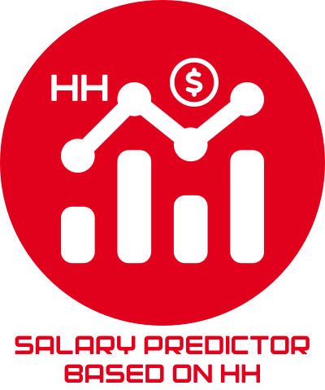
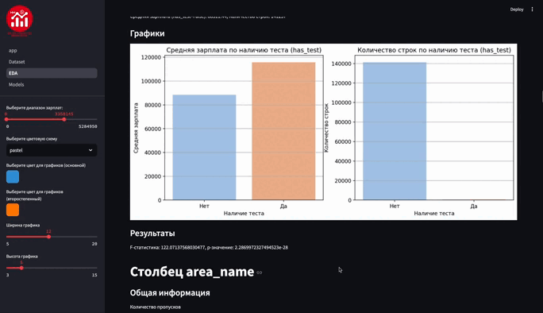

# Проект "Вакансии с портала HeadHunter"

### Студенты:
Аладинский Георгий Александрович (@gogaTheBest)

Дмитрий Тапанович Мандал (@dimatrp)

Панов Артём Сергеевич (@arsepan)

Больбот Елизавета Владимировна (@piv_liker)

### Руководитель: 
Надежда Гераськина (@Nadya_Gera)

# Описание проекта

Проект направлен на анализ вакансий с целью предсказания зарплат и выявления ключевых навыков. Он включает в себя автоматизированный сбор данных с сайтов вакансий, использование моделей машинного и глубокого обучения для предсказания зарплат по описаниям позиций и анализ востребованных навыков. Также проект предусматривает визуализацию данных и анализ динамики изменений зарплат и навыков во времени.

Описание работы представлено в файле report.md

# Чекпоинты

Чекпоинт 1 ✅

Чекпоинт 2 ✅

Чекпоинт 3 ✅

Чекпоинт 4 ❓

# Приложение

[Via GIPHY](https://giphy.com/gifs/RBjaaYDkqbdl5YBLS)

